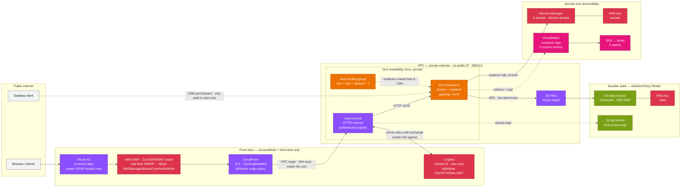

# Kiro Crew on AWS

Run a [Kiro Crew](https://kiro.dev/crew/) Gateway 24/7 in your own AWS account, with all
durable agent state held in Amazon S3 so the compute host is disposable.

One CloudFormation template, 82 resources. `cfn-lint` and the AWS CLI are the only tools you
need — no CDK bootstrap, no build toolchain.

**Status: deployed and verified.** Front door, S3 Files data home, agent sandbox and
self-healing compute are all in the template and exercised against a live account. Recovery from
instance termination is measured at 134 seconds with no human involvement.

## Why this exists

Crew is a persistent workspace: it runs cron jobs, drives long tasks, and holds Slack and
Discord connections. All of that only works while the Gateway is running, which is awkward on a
laptop that sleeps. Crew's own docs recommend an always-on host; this repository is that host as
infrastructure as code, with three properties worth the effort:

- **The host is disposable.** State lives in S3, so a replacement instance resumes your
  memories, lessons, conversations, crons and skills — and stays signed in.
- **It heals itself.** A single-instance Auto Scaling group replaces a host that dies, is
  terminated, or gets retired by AWS.
- **Nothing is exposed by accident.** The instance has no public IP and, in `ssm-only` mode, no
  inbound security-group rule at all.

## Architecture

Everything below is in the template and deployed. `AccessMode=front-door` builds the top two
groups; `AccessMode=ssm-only` builds neither.



In `ssm-only` mode there is no Route 53 record, no WAF, no CloudFront, no ALB and no Cognito —
and therefore no certificate and no domain requirement. You reach the dashboard by forwarding a
port over AWS Systems Manager.

## Prerequisites

**Region is us-east-1, and this is not a parameter.** CloudFront's viewer certificate and a
`CLOUDFRONT`-scoped WAF web ACL can only exist in us-east-1, and a single-region template cannot
create them from elsewhere. The template asserts this and fails fast.

### Tools on your machine

| Requirement | Notes |
|---|---|
| AWS CLI v2 | Recent enough to include `s3files`. The scripts fall back to boto3, so an older CLI works if botocore is current. |
| `cfn-lint` | `pip install cfn-lint`. `scripts/deploy.sh` refuses to run without it. |
| Python 3 | Used by the scripts for JSON and CIDR arithmetic. |
| `gh`, authenticated | Only for `scripts/verify-image.sh`. Docker is **not** required. |
| Credentials that can create IAM roles | The stack creates two IAM roles, two KMS keys, Cognito, CloudFront and WAF. A read-only or narrowly-scoped role will fail partway through and roll back. |

An S3 staging bucket is **not** something you provide — the template is 77 KB, past
CloudFormation's 51,200-byte inline limit, so `deploy.sh` creates one (private, encrypted) if
absent and uploads the template before deploying.

### If `AccessMode=front-door`: three things must exist first

This is the part people get wrong, because owning a domain is **not** sufficient.

1. **A registered domain.** Not optional and there is no workaround.
   `authenticate-cognito` is valid only on an HTTPS listener, that listener needs a certificate
   matching the host CloudFront forwards, and ACM will not issue for a `cloudfront.net` name.
2. **A Route 53 public hosted zone for that domain, in the same AWS account.** The stack creates
   an `AWS::Route53::RecordSet` alias pointing at the distribution, so it needs a
   `HostedZoneId` it can write into. A domain registered elsewhere works only if you delegate it
   to a Route 53 hosted zone here, or you remove the record from the template and create the
   alias yourself.
3. **An ACM certificate in us-east-1, status `ISSUED`, covering `DomainName`.** Bring your own;
   the template does not request or validate one, because DNS validation is not something a
   stack can wait on reliably. `deploy.sh` checks the status and refuses to continue if it is
   anything but `ISSUED`. A wildcard works, and **one certificate serves both** the CloudFront
   viewer connection and the ALB listener because the region is pinned.

Without a domain, use `AccessMode=ssm-only`. You lose the browser front door and reach the
dashboard over a forwarded port instead; nothing else changes.

### If `NetworkMode=existing`: what your VPC must already satisfy

`deploy.sh` verifies all of these before creating anything, and blocks with the offending
resource named. Worth knowing up front so you can pick subnets that qualify:

- **Exactly two private subnets, in two distinct Availability Zones**, both belonging to the
  `VpcId` you give. The ALB requires two.
- **A default route to a NAT gateway or transit gateway on both.** The host pulls a container
  image and reaches the Kiro model endpoint; with no egress the Gateway hangs on the image pull.
- **VPC DNS hostnames and DNS resolution both enabled.** The mount resolves its target by
  hostname and cannot mount without them.
- **S3 Files must support a mount target in the first subnet's Availability Zone.** No API
  answers this, so the script says so rather than implying it verified it.
- **No other security group in the VPC admitting your Crew subnets by CIDR** — a judgement call
  rather than a bug, and the one check you can consciously override. See
  [Check 5 and shared VPCs](#check-5-and-shared-vpcs).

### Two steps that need a human after `deploy.sh` finishes

Neither can be automated, and the deployment is not usable until both are done:

- **Confirm the SNS subscription email.** AWS sends it to `NotificationEmail`; until you click
  it, **no alarm can reach you**.
- **Sign in `kiro-cli` on the host.** A device-code flow over Session Manager, which means
  copying a code into a browser. Agent sessions fail until this is done. `runbook.md` has the
  exact command and the two flags that are load-bearing.

## Deploy

```bash
git clone https://github.com/aidin-repo/kirocrew-on-aws.git && cd kirocrew-on-aws

# 1. Confirm the image you are about to run, and get its digest.
scripts/verify-image.sh stable

# 2. Fill in your values.
cp infra/params.example.json infra/params.json
$EDITOR infra/params.json

# 3. Check everything without creating any infrastructure.
scripts/deploy.sh --params infra/params.json --validate-only

# 4. Deploy.
scripts/deploy.sh --params infra/params.json
```

`infra/params.json` is gitignored. Do not commit it.

**One caveat on `--validate-only`:** it creates no stack and no infrastructure, but it is not
literally side-effect free. `validate-template` cannot accept a body over 51,200 bytes, so a
template this size must be validated from S3 — which means the staging bucket is created (if
absent) and the template object uploaded before validation runs. Below that size limit nothing
is created at all.

### Parameters

| Parameter | Default | Notes |
|---|---|---|
| `AccessMode` | `ssm-only` | `front-door` requires a domain and one ACM cert |
| `NetworkMode` | `existing` | `existing` reuses your VPC and NAT, usually at no extra cost |
| `VpcId`, `PrivateSubnetIds` | — | Required when `NetworkMode=existing`. Two private subnets in distinct AZs |
| `EgressMode` | `nat-instance` | Ignored when `NetworkMode=existing` |
| `DomainName`, `HostedZoneId` | — | Required when `AccessMode=front-door` |
| `CertificateArn` | — | One ACM cert in us-east-1 covering `DomainName`; serves CloudFront **and** the ALB |
| `InstanceType` | `r8g.large` | Graviton4, 2 vCPU / 16 GiB, ~$86/mo. Best price-performance clearing Crew's RAM floor. Subagent concurrency scales with **memory**, not cores, so `r8g.xlarge` is the lever for fan-out |
| `MfaMode` | `ON` | `ON` / `OPTIONAL` / `OFF`. Turning it off on a public endpoint fronting a shell-capable agent is a real reduction |
| `ContainerImageDigest` | pinned | The multi-arch **index** digest, not a per-architecture one |
| `SeccompProfileSha256` | pinned | Boot verifies the sandbox profile and **fails closed** on mismatch. Update if upstream revises it |
| `DataHomeUid`, `DataHomeGid` | `1000` | Create-only on the access point: changing either **replaces** it |
| `LogRetentionDays`, `NotificationEmail`, `OwnerTag` | — | `OwnerTag` distinguishes multiple Gateways in one account |

## Traps this template already encodes

Every one of these cost hours to find and produces a symptom that points somewhere else. They
are the reason this repository exists rather than a blog snippet.

**The ALB needs egress on 443.** `authenticate-cognito` makes the load balancer an HTTP
*client*: it calls the Cognito token endpoint server-side to exchange the authorization code.
Give its security group egress only to the target group and that call is blackholed — sign-in
succeeds, then the browser gets **500** with `AuthTokenEpRequestTimeout` in the ALB access log.
Cannot be narrowed: no prefix list covers the hosted UI domain.

**Crew rejects your domain until you declare it.** A DNS-rebinding barrier requires the `Host`
header to name a host Crew serves, derived from its CSRF origin allowlist. Behind CloudFront
every request is `403 Host header not allowed` until `KIROCREW_CORS_ORIGINS` names your origin.

**Docker's default seccomp breaks the agent sandbox.** Crew isolates each agent subprocess in a
user namespace, and the default profile denies `unshare(CLONE_NEWUSER)` with EPERM. The
dashboard serves happily and every agent turn fails. Boot fetches upstream's profile — the
Docker default plus `unshare`/`clone`/`mount` allows, still `defaultAction: SCMP_ACT_ERRNO` —
pinned by SHA256. `KIROCREW_ALLOW_UNSANDBOXED` is never set: this host holds an IAM role, so the
container must not be the only boundary around agent-authored code.

**kiro-cli's credentials must live outside the data home.** Crew hides its own data home from
the CLI it probes and from every agent session. Because this deployment sets `KIROCREW_HOME` to
the whole home directory, a credential store at `~/.local/share/kiro-cli` is hidden too — so
`kiro-cli whoami` succeeds from a shell while Crew reports "not signed in", with no error
anywhere and `sandbox_unavailable: false`. `XDG_DATA_HOME=/xdg-data` splits the paths while
keeping the bytes on S3.

**An ASG cannot use your CMK without a key policy grant.** The Auto Scaling service-linked role
provisions EBS on the group's behalf, and its AWS-managed identity policy does not convey use of
a customer key. Without the grant every launch fails with
`Client.InvalidKMSKey.InvalidState: The KMS key provided is in an incorrect state` — misleading,
since the key is healthy and the problem is authorization — and the ASG retries forever, so the
stack **hangs** instead of failing fast.

**An alarm on an ASG cannot pin an instance id.** A dimension of `!Ref Instance` goes stale on
every self-heal, and CloudWatch rejects the obvious fix: `SEARCH is not supported on Metric
Alarms`. So `crew-health.sh` publishes dimensionless `GatewayHealthy`, `DataHomeReadable` and
`BucketAccessible` instead. Related: an alarm whose dimensions do not match the published
metric sits in `INSUFFICIENT_DATA` forever while the metric is plainly visible in the console.

`runbook.md` has the full diagnosis for each, plus the sign-in gotchas — `--use-device-flow
--license pro`, the five-minute token behind a `--ttl 12h` flag, and why the setup wizard's
commands need a `docker exec` prefix.

## What `deploy.sh` checks before it creates anything

CloudFormation cannot validate any of these, and each fails somewhere misleading. The numbers
are stable labels the script prints, **not** execution order — it runs check 4 first because a
DNS-disabled VPC cannot mount S3 Files at all, so there is no point doing the expensive work.
These five apply when `NetworkMode=existing`:

1. **Both subnets have a default route to a NAT or transit gateway.** No egress produces a
   Gateway that hangs on the container pull and an error pointing at the wrong resource.
2. **The subnets are in two distinct AZs.** The ALB requires two.
3. **S3 Files supports a mount target in the first subnet's AZ.** No API can answer this, so the
   script says so plainly rather than implying it verified something.
4. **VPC DNS hostnames and resolution are enabled.** The mount resolves its target by hostname.
5. **No other security group in the VPC admits the Crew subnets by CIDR.** A judgement call, not
   a bug — see below.

It also asserts things that are not part of that numbered set: the region is us-east-1; the S3
Files API answers `ListFileSystems` in this account; exactly two subnets are given and both
belong to `VpcId`; and, for `AccessMode=front-door`, that `DomainName`, `HostedZoneId` and
`CertificateArn` are present, the certificate is `ISSUED`, and the CloudFront origin-facing
prefix list resolves.

### Check 5 and shared VPCs

Reusing a VPC is the cheapest option and usually right. But this host runs an agent with shell
access, an instance role, and internet egress. Group-ID rules mean this stack grants nothing to
anything else; the reverse is not guaranteed. Another workload with a CIDR-based inbound rule
covering the Crew subnets is laterally reachable from a prompt-injected agent.

`deploy.sh` **blocks** on that and prints the offending rules. To accept it deliberately:

```bash
KIROCREW_ACCEPT_SHARED_VPC=1 scripts/deploy.sh --params infra/params.json
```

If the VPC already hosts another agentic system with its own IAM roles, consider
`NetworkMode=create` with `EgressMode=nat-instance` instead: a dedicated network for a few
dollars a month.

## Operating it

**To pause, scale to zero. Do not stop the instance.** An ASG reads a stopped instance as
unhealthy and terminates it, so stopping destroys the host instead of pausing it.

```bash
ASG=$(aws cloudformation describe-stacks --stack-name <stack> \
  --query 'Stacks[0].Outputs[?OutputKey==`AutoScalingGroupName`].OutputValue' --output text)
aws autoscaling set-desired-capacity --auto-scaling-group-name "$ASG" --desired-capacity 0
```

There is no fixed instance id. Resolve the live one for SSM:

```bash
aws autoscaling describe-auto-scaling-groups --auto-scaling-group-names "$ASG" \
  --query 'AutoScalingGroups[0].Instances[0].InstanceId' --output text
```

Measured recovery, all tested on a live deployment:

| Action | Instance | Time to healthy |
|---|---|---|
| Reboot | kept | under 90s; ASG does not react |
| Terminate | replaced automatically | 134s |
| Stop | terminated and replaced | 237s |

Sentinel ETag and the kiro-cli credential store came through all three byte-identical.

## Cost

Not priced against the calculator; these are magnitudes.

| Configuration | Rough monthly |
|---|---|
| `ssm-only` + `NetworkMode=existing` | An instance and a bucket. The cheapest useful shape |
| `ssm-only` + `NetworkMode=create` + `nat-instance` | Above, plus a few dollars |
| `front-door` + `NetworkMode=create` + `nat-gateway` | Above, plus roughly $32 NAT and $16–22 ALB |

The instance dominates in every case (~$86/mo for `r8g.large`), and a Savings Plan is the main
lever on a 24/7 workload. Two KMS keys add $2/mo; `BucketKeyEnabled` keeps KMS request charges
negligible. Scaling to zero removes most of the bill; the ALB, CloudFront and NAT keep charging.

**On VPC endpoints.** Kiro publishes PrivateLink service names
(`com.amazonaws.us-east-1.q`, `com.amazonaws.us-east-1.codewhisperer`), and with private DNS
enabled `runtime.us-east-1.kiro.dev` resolves through them — so a zero-egress deployment is
achievable. It is a data-perimeter measure, **not** a saving: the eleven or so interface
endpoints bill well above a single NAT gateway. Note that boot currently fetches the seccomp
profile from GitHub, so a zero-egress deployment must stage that file itself.

## Security posture

- Instance in a private subnet, no public IP, no key pair, IMDSv2 required with hop limit 1.
- In `ssm-only` mode the host security group has **no ingress rule at all**.
- Three layers in `front-door` mode: WAF and CloudFront, then Cognito, then Crew's own minted
  session token. Cognito is additive and never replaces Crew's token.
- The state bucket is encrypted with a customer-managed key, versioned, Block Public Access
  fully on, and denies non-TLS requests.
- Crew's OS sandbox stays enabled, via upstream's seccomp profile rather than by disabling it.
- Secrets live in Secrets Manager and are fetched by the instance role at boot. No secret value
  appears in the template, in parameters, in user data, or in any log.

**Two honest limits.**

The state key's policy is a single `DelegateToIam` statement, and the bucket policy only denies
non-TLS. So **any principal in the account with S3 and KMS permissions can read conversation
content** — the customer-managed key currently buys rotation control, a distinct ARN and a kill
switch, not isolation from your own admin role. Restricting decrypt to the instance role is a
deliberate next step, and it means locking yourself out too.

cgroup v2 scope enforcement is unavailable, because the container has no `systemd-run`. The
user-namespace sandbox still isolates each agent subprocess, but there is no memory or
process-count ceiling on it: instance memory is the only backstop against a runaway.

## Availability

Bounded to one AZ, deliberately. There is one S3 Files mount target, and an instance launched in
another AZ cannot reach it and fails closed at `crew-mount.service`, so the ASG is pinned to
that subnet. An AZ outage is an outage. A second mount target would widen this, but the
single-writer SQLite constraint means it buys faster recovery, not redundancy.

## Repository layout

```
infra/kirocrew.yaml           the entire stack (82 resources, ~1850 lines)
infra/params.example.json     copy to params.json and edit
scripts/deploy.sh             pre-flight, lint, stage, deploy; --validate-only creates no stack
scripts/verify-image.sh       resolve the image digest and verify SLSA provenance
scripts/rebuild-drill.sh      terminate via the ASG, time recovery, assert integrity
runbook.md                    bootstrap, access, sign-in traps, self-heal behaviour, rotation
.cfnlintrc.yaml               suppresses one stale-schema false positive, with the reason
.kiro/specs/                  the requirements/design/tasks that drove this build
```

The spec documents under `.kiro/specs/` are included because this stack was built spec-first and
the reasoning is part of what the repository is for. They are a **historical record, not
documentation**: where they and this README disagree, the README and `runbook.md` are
authoritative, because they were revised against the deployed system and the specs were not.

Not published: `docs/` holds the raw pre-flight and storage-verification records for the account
this was developed against, down to VPC, subnet, filesystem and instance ids, so it is
gitignored. Every measurement worth having from it is quoted in this README and in
`runbook.md`.

## Teardown

```bash
aws cloudformation delete-stack --region us-east-1 --stack-name <stack>
```

The state bucket and the log bucket carry `DeletionPolicy: Retain`, so **your data survives
stack deletion** and you delete those buckets yourself when you actually mean to. Deleting the
stack removes the Auto Scaling group, which terminates the instance. In `NetworkMode=existing`
the stack never owned your VPC or NAT, so neither is touched.

## Related

- [Kiro Crew](https://github.com/kirodotdev/KiroCrew) — the project this deploys
- [Running 24/7](https://kiro.dev/docs/crew/running-24-7/) — upstream guidance on remote hosts
- [Crew security model](https://kiro.dev/docs/crew/security/) — the layers this relies on
