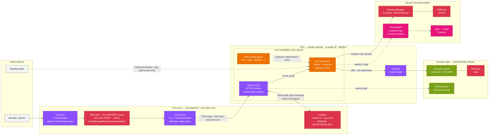

# Kiro Crew on AWS

Run a [Kiro Crew](https://kiro.dev/crew/) Gateway 24/7 in your own AWS account, with all durable
agent state held in Amazon S3 so the compute host is disposable.

One CloudFormation template, 82 resources. `cfn-lint` and the AWS CLI are the only tools you
need — no CDK bootstrap, no build toolchain.

**Status: deployed and verified.** Front door, S3 data home, agent sandbox and self-healing
compute are all in the template and exercised against a live account. Recovery from instance
termination is measured at 134 seconds with no human involvement.

## What you get

- **An always-on Gateway.** Cron jobs fire, long tasks finish, Slack and Discord connections stay
  up whether or not your laptop is awake.
- **A disposable host.** State lives in S3, so a replacement instance resumes your memories,
  lessons, conversations, crons and skills — and stays signed in.
- **Self-healing compute.** A single-instance Auto Scaling group replaces a host that dies, is
  terminated, or gets retired by AWS.
- **Two access modes.** A browser front door on your own domain, or no public endpoint at all.
- **Nothing exposed by accident.** The instance has no public IP and, in `ssm-only` mode, no
  inbound security-group rule.

## Use cases

**Scheduled agent work.** Crew's cron jobs only run while the Gateway is up. On an always-on host
you can schedule a nightly dependency-and-CVE sweep across your repositories, a morning digest of
issues and pull requests waiting on you, or a recurring report that reads a data source and writes
somewhere else.

**Long-running tasks you start and walk away from.** A migration across dozens of files, a
refactor with a test loop, a backlog of small fixes. Start it from your phone, close the laptop,
read the result later.

**Chat-driven operations.** With the Slack or Discord integration connected, a team can talk to one
Crew instance that keeps its memory across conversations, instead of each person running a separate
short-lived agent.

**Access from anywhere.** In `front-door` mode the dashboard is a normal HTTPS site on your domain,
behind WAF and Cognito, so a phone browser is a first-class client.

**A shared team workspace.** Crew's memory, lessons and skills accumulate in one place. Cognito
controls who reaches the dashboard; `OwnerTag` lets you run more than one Gateway in the same
account without name collisions.

**A private deployment for sensitive work.** The whole thing sits in your account, in private
subnets, with conversation content in a bucket encrypted by a customer-managed key.

## How it works

`AccessMode=front-door` builds the top two groups. `AccessMode=ssm-only` builds neither.



The Gateway runs as a Docker container under systemd on a Graviton instance in a private subnet.
Its data home is an S3-backed filesystem mounted over NFS, so memories, conversations, cron
definitions, skills and the signed-in CLI credential store all live in a versioned S3 bucket rather
than on the instance. Boot is four systemd units in order: mount the data home, fetch secrets with
the instance role, start the Gateway, start a health timer that publishes three CloudWatch metrics.

Because nothing durable is on the instance, the Auto Scaling group can replace it freely. The group
is fixed at one instance — the data home is SQLite, so a second writer is not safe — and exists
only to self-heal.

In `ssm-only` mode there is no Route 53 record, no WAF, no CloudFront, no ALB and no Cognito, and
therefore no certificate and no domain requirement. You reach the dashboard by forwarding a port
over AWS Systems Manager.

## Prerequisites

**Region is us-east-1, and this is not a parameter.** CloudFront's viewer certificate and a
`CLOUDFRONT`-scoped WAF web ACL can only exist in us-east-1. The template asserts this and fails
fast.

### Tools on your machine

| Requirement | Notes |
|---|---|
| AWS CLI v2 | Recent enough to include `s3files`. The scripts fall back to boto3, so an older CLI works if botocore is current. |
| `cfn-lint` | `pip install cfn-lint`. `scripts/deploy.sh` refuses to run without it. |
| Python 3 | Used by the scripts for JSON and CIDR arithmetic. |
| `gh`, authenticated | Only for `scripts/verify-image.sh`. Docker is **not** required. |
| Credentials that can create IAM roles | The stack creates two IAM roles, two KMS keys, Cognito, CloudFront and WAF. A read-only or narrowly-scoped role will fail partway through and roll back. |

An S3 staging bucket is not something you provide. The template is 77 KB, past CloudFormation's
51,200-byte inline limit, so `deploy.sh` creates one (private, encrypted) if absent and uploads the
template before deploying.

### If `AccessMode=front-door`: three things must exist first

Owning a domain is not sufficient on its own.

1. **A registered domain.** `authenticate-cognito` is valid only on an HTTPS listener, that listener
   needs a certificate matching the host CloudFront forwards, and ACM will not issue for a
   `cloudfront.net` name.
2. **A Route 53 public hosted zone for that domain, in the same AWS account.** The stack creates an
   `AWS::Route53::RecordSet` alias pointing at the distribution, so it needs a `HostedZoneId` it can
   write into. A domain registered elsewhere works only if you delegate it to a Route 53 hosted zone
   here, or you remove the record from the template and create the alias yourself.
3. **An ACM certificate in us-east-1, status `ISSUED`, covering `DomainName`.** Bring your own; the
   template does not request or validate one. `deploy.sh` checks the status and refuses to continue
   if it is anything but `ISSUED`. A wildcard works, and **one certificate serves both** the
   CloudFront viewer connection and the ALB listener because the region is pinned.

Without a domain, use `AccessMode=ssm-only`. You lose the browser front door and reach the dashboard
over a forwarded port instead; nothing else changes.

### If `NetworkMode=existing`: what your VPC must already satisfy

`deploy.sh` verifies all of these before creating anything, and blocks with the offending resource
named:

- **Exactly two private subnets, in two distinct Availability Zones**, both belonging to the `VpcId`
  you give. The ALB requires two.
- **A default route to a NAT gateway or transit gateway on both.** The host pulls a container image
  and reaches the Kiro model endpoint.
- **VPC DNS hostnames and DNS resolution both enabled.** The mount resolves its target by hostname.
- **S3 Files must support a mount target in the first subnet's Availability Zone.** No API answers
  this, so the script says so rather than implying it verified it.
- **No other security group in the VPC admitting your Crew subnets by CIDR.** See
  [Shared VPCs](#shared-vpcs).

## Deploy

```bash
git clone https://github.com/aidin-repo/kirocrew-on-aws.git && cd kirocrew-on-aws

# 1. Confirm the image you are about to run, and get its digest.
scripts/verify-image.sh stable

# 2. Fill in your values.
cp infra/params.example.json infra/params.json
$EDITOR infra/params.json

# 3. Check everything without creating any infrastructure.
scripts/deploy.sh --params infra/params.json --validate-only

# 4. Deploy.
scripts/deploy.sh --params infra/params.json
```

`infra/params.json` is gitignored. Do not commit it.

`deploy.sh` also takes `--stack <name>` (default `kirocrew`), `--profile <name>` and
`--template <path>`.

**One caveat on `--validate-only`:** it creates no stack and no infrastructure, but it is not
literally side-effect free. `validate-template` cannot accept a body over 51,200 bytes, so a
template this size must be validated from S3 — which means the staging bucket is created (if absent)
and the template object uploaded before validation runs.

### Parameters

| Parameter | Default | Notes |
|---|---|---|
| `AccessMode` | `ssm-only` | `front-door` requires a domain and one ACM cert |
| `NetworkMode` | `existing` | `existing` reuses your VPC and NAT, usually at no extra cost |
| `VpcId`, `PrivateSubnetIds` | — | Required when `NetworkMode=existing`. Two private subnets in distinct AZs |
| `VpcCidr` | `10.20.0.0/16` | Only used when `NetworkMode=create` |
| `EgressMode` | `nat-instance` | Only used when `NetworkMode=create`. `nat-instance` is roughly a tenth the cost of `nat-gateway` |
| `DomainName`, `HostedZoneId` | — | Required when `AccessMode=front-door` |
| `CertificateArn` | — | One ACM cert in us-east-1 covering `DomainName`; serves CloudFront **and** the ALB |
| `InstanceType` | `r8g.large` | Graviton4, 2 vCPU / 16 GiB, ~$86/mo. Subagent concurrency scales with **memory**, so `r8g.xlarge` is the lever for wider fan-out |
| `MfaMode` | `ON` | `ON` / `OPTIONAL` / `OFF`. Only weaken deliberately: this is a public endpoint fronting a shell-capable agent |
| `ContainerImageDigest` | pinned | The multi-arch **index** digest, not a per-architecture one. Re-resolve with `verify-image.sh` |
| `DataHomeUid`, `DataHomeGid` | `1000` | Create-only on the access point: changing either **replaces** it |
| `LogRetentionDays` | `30` | CloudWatch log retention |
| `NotificationEmail` | — | Alarm destination. Must be confirmed after deploy |
| `OwnerTag` | `kirocrew` | Distinguishes multiple Gateways in one account; globally unique names derive from stack name plus this |

### Two steps that need a human after `deploy.sh` finishes

Neither can be automated, and the deployment is not usable until both are done.

**1. Confirm the SNS subscription email.** AWS sends it to `NotificationEmail`; until you click it,
no alarm can reach you.

**2. Sign in `kiro-cli` on the host.** A device-code flow over Session Manager:

```bash
INSTANCE=$(aws autoscaling describe-auto-scaling-groups --auto-scaling-group-names "$ASG" \
  --query 'AutoScalingGroups[0].Instances[0].InstanceId' --output text)
aws ssm start-session --region us-east-1 --target "$INSTANCE"

sudo docker exec -it crew kiro-cli login --use-device-flow --license pro
```

Both flags matter. `--use-device-flow` avoids a browser launch that cannot work on a headless host,
and `--license pro` selects Identity Center rather than a Builder ID. Agent sessions fail until this
completes, and the `GatewayHealthy` alarm fires in the meantime — expected during bootstrap.
`runbook.md` covers the details, including the token that lasts five minutes regardless of `--ttl`.

### Shared VPCs

Reusing a VPC is the cheapest option and usually right. But this host runs an agent with shell
access, an instance role, and internet egress. Group-ID rules mean this stack grants nothing to
anything else; the reverse is not guaranteed. Another workload with a CIDR-based inbound rule
covering the Crew subnets is laterally reachable from a prompt-injected agent.

`deploy.sh` **blocks** on that and prints the offending rules. To accept it deliberately:

```bash
KIROCREW_ACCEPT_SHARED_VPC=1 scripts/deploy.sh --params infra/params.json
```

If the VPC already hosts another agentic system with its own IAM roles, consider
`NetworkMode=create` with `EgressMode=nat-instance` instead: a dedicated network for a few dollars a
month.

## Using it

### Reach the dashboard

In `front-door` mode, open the `DashboardUrl` output. Create your user in the Cognito user pool
first — self-signup is disabled.

In `ssm-only` mode, forward the port, then open `localhost:5476`:

```bash
aws ssm start-session --region us-east-1 --target "$INSTANCE" \
  --document-name AWS-StartPortForwardingSession \
  --parameters '{"portNumber":["5476"],"localPortNumber":["5476"]}'
```

Either way, Crew mints its own session token on the host:

```bash
sudo docker exec crew kirocrew token --ttl 12h
```

The printed URL names `localhost`; behind the front door, substitute your own domain or paste the
bare token into the dashboard's banner field. Mint immediately before use.

### Pause and resume

**To pause, scale to zero. Do not stop the instance.** An ASG reads a stopped instance as unhealthy
and terminates it, so stopping destroys the host instead of pausing it.

```bash
ASG=$(aws cloudformation describe-stacks --stack-name <stack> \
  --query 'Stacks[0].Outputs[?OutputKey==`AutoScalingGroupName`].OutputValue' --output text)
aws autoscaling set-desired-capacity --auto-scaling-group-name "$ASG" --desired-capacity 0
aws autoscaling set-desired-capacity --auto-scaling-group-name "$ASG" --desired-capacity 1
```

### Find the live instance

There is no fixed instance id:

```bash
aws autoscaling describe-auto-scaling-groups --auto-scaling-group-names "$ASG" \
  --query 'AutoScalingGroups[0].Instances[0].InstanceId' --output text
```

### Check health

```bash
systemctl is-active crew-mount.service crew-secrets.service crew-gateway.service crew-health.timer
sudo docker exec crew kirocrew doctor
sudo docker logs --tail 100 crew
```

`crew-health.sh` publishes `GatewayHealthy`, `DataHomeReadable` and `BucketAccessible` to namespace
`KiroCrew/<stack-name>`, all with no dimensions so they stay alarmable across instance replacement.
Five alarms notify the SNS topic. S3 Files publishes its own metrics under `AWS/S3/Files` — watch
`PendingExports` and `ExportFailures`.

### Measured recovery

All tested on a live deployment:

| Action | Instance | Time to healthy |
|---|---|---|
| Reboot | kept | under 90s; ASG does not react |
| Terminate | replaced automatically | 134s |
| Stop | terminated and replaced | 237s |

Sentinel ETag and the kiro-cli credential store came through all three byte-identical, so a
replacement host resumes already signed in. `scripts/rebuild-drill.sh` runs this drill for you:
terminate through the ASG, time recovery, assert integrity.

### Rotate a secret

Update the value in Secrets Manager, then restart. No rebuild, no template change.

```bash
sudo systemctl restart crew-gateway.service
```

`runbook.md` is the full operational reference: access, bootstrap, health, self-heal behaviour,
storage facts to know before trusting a restore, and troubleshooting for the failure modes that
produce misleading symptoms.

## Cost

Not priced against the calculator; these are magnitudes.

| Configuration | Rough monthly |
|---|---|
| `ssm-only` + `NetworkMode=existing` | An instance and a bucket. The cheapest useful shape |
| `ssm-only` + `NetworkMode=create` + `nat-instance` | Above, plus a few dollars |
| `front-door` + `NetworkMode=create` + `nat-gateway` | Above, plus roughly $32 NAT and $16–22 ALB |

The instance dominates in every case (~$86/mo for `r8g.large`), and a Savings Plan is the main lever
on a 24/7 workload. Two KMS keys add $2/mo; `BucketKeyEnabled` keeps KMS request charges negligible.
Scaling to zero removes most of the bill; the ALB, CloudFront and NAT keep charging.

**On VPC endpoints.** Kiro publishes PrivateLink service names (`com.amazonaws.us-east-1.q`,
`com.amazonaws.us-east-1.codewhisperer`), and with private DNS enabled `runtime.us-east-1.kiro.dev`
resolves through them, so a zero-egress deployment is achievable. It is a data-perimeter measure,
not a saving: the eleven or so interface endpoints bill well above a single NAT gateway. Boot
currently fetches the seccomp profile from GitHub, so a zero-egress deployment must stage that file
itself.

## Security posture

- Instance in a private subnet, no public IP, no key pair, IMDSv2 required with hop limit 1.
- In `ssm-only` mode the host security group has **no ingress rule at all**.
- Three layers in `front-door` mode: WAF and CloudFront, then Cognito, then Crew's own minted session
  token. Cognito is additive and never replaces Crew's token.
- The state bucket is encrypted with a customer-managed key, versioned, Block Public Access fully on,
  and denies non-TLS requests.
- Crew's OS sandbox stays enabled, via upstream's seccomp profile pinned by SHA256, rather than by
  disabling it. Boot fails closed on mismatch.
- Secrets live in Secrets Manager and are fetched by the instance role at boot. No secret value
  appears in the template, in parameters, in user data, or in any log.

**Two honest limits.**

The state key's policy is a single `DelegateToIam` statement, and the bucket policy only denies
non-TLS. So any principal in the account with S3 and KMS permissions can read conversation content —
the customer-managed key currently buys rotation control, a distinct ARN and a kill switch, not
isolation from your own admin role. Restricting decrypt to the instance role is a deliberate next
step, and it means locking yourself out too.

cgroup v2 scope enforcement is unavailable, because the container has no `systemd-run`. The
user-namespace sandbox still isolates each agent subprocess, but there is no memory or process-count
ceiling on it: instance memory is the only backstop against a runaway.

## Availability

Bounded to one AZ, deliberately. There is one S3 Files mount target, and an instance launched in
another AZ cannot reach it and fails closed at `crew-mount.service`, so the ASG is pinned to that
subnet. An AZ outage is an outage. A second mount target would widen this, but the single-writer
SQLite constraint means it buys faster recovery, not redundancy.

## Repository layout

```
infra/kirocrew.yaml           the entire stack (82 resources, ~1850 lines)
infra/params.example.json     copy to params.json and edit
scripts/deploy.sh             pre-flight, lint, stage, deploy; --validate-only creates no stack
scripts/verify-image.sh       resolve the image digest and verify SLSA provenance
scripts/rebuild-drill.sh      terminate via the ASG, time recovery, assert integrity
runbook.md                    bootstrap, access, self-heal behaviour, troubleshooting, rotation
blog-post.md                  a walkthrough of the deployment
.cfnlintrc.yaml               suppresses one stale-schema false positive, with the reason
.kiro/specs/                  the requirements/design/tasks that drove this build
```

The spec documents under `.kiro/specs/` are a **historical record, not documentation**: where they
and this README disagree, the README and `runbook.md` are authoritative, because they were revised
against the deployed system and the specs were not.

Not published: `docs/` holds the raw pre-flight and storage-verification records for the account this
was developed against, down to VPC, subnet, filesystem and instance ids, so it is gitignored. Every
measurement worth having from it is quoted in this README and in `runbook.md`.

## Teardown

```bash
aws cloudformation delete-stack --region us-east-1 --stack-name <stack>
```

The state bucket and the log bucket carry `DeletionPolicy: Retain`, so **your data survives stack
deletion** and you delete those buckets yourself when you actually mean to. Deleting the stack
removes the Auto Scaling group, which terminates the instance. In `NetworkMode=existing` the stack
never owned your VPC or NAT, so neither is touched.

The same mechanism applies to a failed create: rollback retains the bucket, and the next deploy under
the same stack name collides with it. Either delete the leftover bucket or use a different stack name.

## Related

- [Kiro Crew](https://github.com/kirodotdev/KiroCrew) — the project this deploys
- [Running 24/7](https://kiro.dev/docs/crew/running-24-7/) — upstream guidance on remote hosts
- [Crew security model](https://kiro.dev/docs/crew/security/) — the layers this relies on
