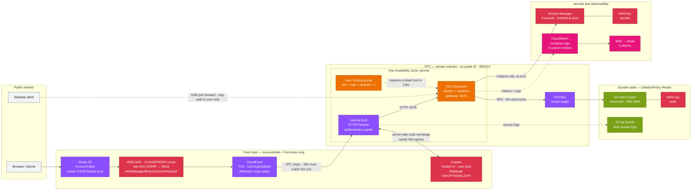

# Every bug was at a seam

## Running an agent workspace 24/7 on AWS, and the six failures that taught me something

I spent a day putting [Kiro Crew](https://kiro.dev/crew/) on AWS so it runs continuously instead
of dying when my laptop sleeps. The infrastructure was the easy part. What took the day was six
failures, and they had something in common that I did not expect.

None of them were in a component. Every single one was at a **seam** — a place where two
independently correct designs met and produced a behaviour neither one was wrong about.

That is the interesting thing, so it is what this post is about. The CloudFormation is in
[the repository](#the-repository); I will not walk through it line by line.

---

## Why run it remotely at all

Crew is a persistent workspace, not a chat window. It runs cron jobs, drives long tasks, holds
Slack and Discord connections, and accumulates memory across sessions. All of that only works
while the gateway process is running, which makes a laptop a poor host: close the lid and your
scheduled jobs stop, your integrations drop, and the agent's continuity is only as good as your
uptime.

So: put it on an always-on host. Which raises the actual design question — if the host is going
to be disposable, where does the state live?

## The state question, and what I measured

Crew keeps everything in a data home: SQLite databases for memory, conversation history, cron
definitions, skills, an embedding model. My first instinct was the obvious one — EBS volume,
periodic sync to S3. It is also the wrong shape, because it makes the host semi-precious: lose
it between syncs and you lose whatever was not synced.

The alternative was to put the data home directly on S3 through a filesystem mount, making the
compute genuinely stateless. The obvious objection is SQLite. SQLite over a network filesystem
has a long history of corruption, and Crew uses WAL mode.

So I did not argue about it. I ran a spike and measured:

| Check | Result |
|---|---|
| `PRAGMA integrity_check` on both databases, on the mount | `ok` |
| Same, after stop/start of the container | `ok` |
| Same, after three *ungraceful* host replacements | `ok` |
| Sentinel file ETag across all replacements | byte-identical |
| Object versions created per 6 hours idle | 33 |
| Object versions created per host rebuild | 157 |

Two things fell out of that which I would not have predicted.

**Churn is dominated by rebuilds, not by running.** 157 versions per replacement against 33 per
six idle hours means a noncurrent-version lifecycle policy should be sized against how often you
rebuild, not how long you run.

**The recovery point is about a minute, not zero.** I had written "zero RPO" in my design because
the data is *on* S3. Then I measured export age and got 66 seconds. The filesystem exports
asynchronously, so a write is durable in the filesystem before it is an object in the bucket.
That is a perfectly reasonable design and it makes "the data is in S3" a claim about steady
state, not about the last second before a crash. I corrected the design document.

That is the mundane version of the seam problem: the filesystem is correct, S3 is correct, and my
inference across the boundary was wrong.

## What I did not build, and why

**Not Fargate.** Two reasons, both disqualifying. ECS deletes the task's volume when the task
stops, so the disposable-host property becomes a data-loss property. And Crew isolates each agent
subprocess in a user namespace, which needs kernel capabilities a Fargate task does not get.

**Not AgentCore Runtime.** It is a good fit for invocation-scoped agents and a bad fit for this.
There is no persistent HTTP surface to put a load balancer in front of, and the lifecycle is
scoped to invocations with idle termination. Crew's whole value here is that it is *up* when
nothing is calling it — that is what makes the cron jobs fire.

So: EC2, Docker, systemd. Unfashionable and correct. Graviton4, 2 vCPU, 16 GiB — chosen on
price-performance rather than lowest price, and sized by memory because Crew scales subagent
concurrency by available memory rather than by core count.

## The architecture, briefly



Two access modes. `front-door` builds the top path and needs a registered domain. `ssm-only`
builds none of it — no CloudFront, no ALB, no WAF, no Cognito, no certificate — and you reach the
dashboard over a forwarded port. The second mode exists because the first has a hard prerequisite
that no amount of cleverness removes: an ALB can only do Cognito authentication on an HTTPS
listener, that listener needs a certificate matching the host, and ACM will not issue a
certificate for a `cloudfront.net` name.

---

## The six seams

### 1. A load balancer that is also an HTTP client

Sign-in worked. Cognito accepted the password, redirected back with an authorization code, and
the browser got **500**.

The ALB access log named it immediately once I had access logs — more on that shortly:

```
500  GET /oauth2/idpresponse?code=...  target=-  error_reason="AuthTokenEpRequestTimeout"
```

`target=-` means the request never reached the application. The load balancer failed by itself.

Here is the seam. `authenticate-cognito` makes the ALB an HTTP **client**: it calls the Cognito
token endpoint server-side to exchange that code. I had given its security group exactly one
egress rule, to the target group on the application port — which is textbook least privilege for
a load balancer, because a load balancer talks to its targets and nothing else.

Both halves are right. A least-privilege egress rule is right. Server-side code exchange is
right. Together they blackhole the token call, and because the packets are dropped rather than
refused, the symptom is a five-second hang and a 500 rather than a connection error.

It cannot even be narrowed: the hosted UI lives on a public endpoint with no prefix list, and the
interface endpoint for the Cognito API does not serve the `/oauth2/*` routes. The fix is egress
on 443 to `0.0.0.0/0`, which looks careless in a review and is in fact required.

### 2. A rebinding defence that has never heard of your domain

With the 500 fixed, every request became **403 Host header not allowed**.

Crew runs a DNS-rebinding barrier: the `Host` header must name a host it actually serves, derived
from its CSRF origin allowlist. Correct, and a defence I want. But behind CloudFront the header
names *my* domain, which Crew has no reason to trust.

Same shape as the first: a barrier that is right, a CDN that is right, and a seam where the
identity of "the host" differs on each side. Declaring the origin fixes it.

### 3. A dashboard that works perfectly and cannot do any work

This one is the reason I am writing the post.

After the 403, the dashboard loaded. It looked completely healthy. And in the logs, on repeat:

```
SandboxUnavailableError: unshare(CLONE_NEWUSER) failed with errno 1 (EPERM).
Running inside a Docker/OCI container where the runtime's seccomp or AppArmor
policy blocks user namespace creation.
```

Crew isolates each agent subprocess in a user namespace. Docker's **default** seccomp profile
denies `unshare(CLONE_NEWUSER)`. So the web tier serves happily while every agent turn fails —
the worst possible split, because the part you look at works.

Docker's default profile is a good default. A user-namespace sandbox is a good isolation
mechanism. The seam is that the sandbox needs precisely the syscall the default profile blocks.

The tempting fix is the environment variable that turns the sandbox off. I did not take it: this
host holds an IAM role with access to the state bucket, so the container must not be the only
boundary around agent-authored code. Upstream ships a seccomp profile that is the Docker default
plus unconditional `unshare`/`clone`/`mount` allows, still `defaultAction: SCMP_ACT_ERRNO`. Boot
fetches it, verifies it against a pinned SHA256, and refuses to start on mismatch.

### 4. The security control that hid the credential it needed

And then the best one.

With the sandbox working, the setup gate said **"Sign in to Kiro — Required"** and would not
clear. Except sign-in was fine:

```
$ docker exec crew kiro-cli whoami
Logged in with IAM Identity Center
Email: ...
Profile: arn:aws:codewhisperer:...:profile/...

$ docker exec crew kiro-cli login --use-device-flow --license pro
error: Already logged in, please logout first
```

Authenticated by every check I could run from a shell. The gateway's own probe disagreed, and the
status endpoint reported `authenticated: false` with — and this is the part that cost me the most
time — **`sandbox_unavailable: false`** and no error anywhere. Nothing was broken. Restarting
changed nothing.

I got this wrong five times before I read the code. I guessed the sandbox was still failing
(the JSON said otherwise). I guessed NFS UID remapping, since a user namespace changes the UID on
the wire and the server judges access by it — plausible, and disproved in one command. I guessed
the 10-second probe timeout, and `whoami` returned in 1.045 seconds. I guessed a stale readiness
latch from boot, and a restart disproved it. I guessed the probe environment stripped `HOME`, and
it is on the allowlist and matches.

Then I stopped guessing and read what the probe actually does:

```python
self._crew_hidden_dirs = tuple(dict.fromkeys(
    str(path) for path in (
        self._data_home,                 # ← this
        self._home / ".kiro" / "crew",
        self._home / ".kirocrew",
    )))
```

Crew hides its own data home from the CLI it probes, and from every agent session, so an agent
cannot read Crew's secrets. Unambiguously correct.

Upstream assumes the data home and the credential store are different trees: Crew in
`~/.kiro/crew/`, the CLI's credentials in `~/.local/share/kiro-cli/`. Hide one, the other stays
visible. The code comment says so explicitly — the readiness probe "must leave those visible … so
a CLI whose valid session lives outside the staged files can read its own credentials."

I had set the data home to the **whole home directory**, because the entire home was the S3
mount and that seemed tidy. So the hide covered `$HOME`, and took the credential store with it.

Two correct security designs. A sandbox that hides secrets from agents, and a filesystem mounted
at `$HOME`. Composed, they make a valid credential invisible to the one process that must read
it — and report it as "not signed in", with no error, no failed check, and a sandbox that
correctly says it is available. It was doing its job perfectly.

The fix moves the credential store to a different **container path** on the same storage, so it
persists in S3 but sits outside the hidden tree. No data migration.

Worth noting what would have happened if I had only cared about the setup gate: agent sessions
run the CLI under the same sandbox with the same hidden paths, so every conversation would have
failed for the identical reason. The gate was not the bug. It was the first thing to notice it.

### 5. An Auto Scaling group that cannot use your own key

Converting the standalone instance to a single-instance ASG so the host self-heals, every launch
died with:

```
Client.InvalidKMSKey.InvalidState: The KMS key provided is in an incorrect state
```

The key was `Enabled` and healthy. The state is fine; the problem is authorization. An ASG
provisions EBS through a service-linked role, and that role's AWS-managed identity policy does
not convey use of a **customer** key — only a key policy statement does. A standalone instance
never hits this, because it launches with your credentials.

The seam is between "customer-managed keys are more controlled" and "the ASG acts on your behalf
through its own principal". And the failure mode is worse than the message: an ASG retries
indefinitely, so the stack sat in `UPDATE_IN_PROGRESS` for an hour before rolling back, rather
than failing in thirty seconds.

Which raised a better question: why is the *root volume* encrypted with a customer key at all? It
carries `DeleteOnTermination`, the data home is on S3, and the AWS-managed key encrypts at rest
identically. That use bought an hour of debugging for no security gain. Keep the customer key
where it earns its place — the bucket holding conversation content, where a key policy can
express something the managed key cannot — and use the managed key where it does not.

### 6. An alarm that cannot name the thing it watches

A smaller one that generalises well.

The mount client publishes a bucket-reachability metric with an `InstanceId` dimension. Under an
ASG there is no stable instance id, so a pinned dimension goes stale on every self-heal. The
obvious fix is rejected outright:

```
SEARCH is not supported on Metric Alarms.
```

Alarms need one deterministic series. So the health script now tests bucket reachability directly
with the instance role and publishes the result with **no dimensions**, which is both stable
across replacement and a more direct test of the thing worth detecting.

There is a related trap in the same family that I hit earlier and that is worth stating on its
own, because it wastes an afternoon: **an alarm whose dimensions do not match the published
metric sits in `INSUFFICIENT_DATA` forever while the metric is plainly visible in the console.**
`INSUFFICIENT_DATA` on a metric you can see is a dimension mismatch, not a publishing failure.

---

## Two lessons that are not about AWS

**Build the observability before the thing it observes can fail.** My design specified ALB access
logs and container logs to CloudWatch. I skipped both as non-essential and got to the first real
500 completely blind — guessing at layers instead of reading a log line that would have named the
cause immediately. The first fix of the day was wiring the logging the design had already
called for. `AuthTokenEpRequestTimeout` was sitting there waiting.

**When a hypothesis fails twice, stop generating hypotheses and read the code.** Five wrong
guesses about the credential problem cost more than reading `_crew_hidden_dirs` would have. Each
guess was individually reasonable, which is exactly what made the pattern hard to notice — and
they all shared an assumption I never checked, that something was *broken*. Nothing was broken.
Every component was working as designed. That class of failure is invisible to "what is broken?"
and obvious to "what does this actually do?".

## What was measured

Recovery, tested on a live deployment:

| Action | Instance | Time to healthy |
|---|---|---|
| Reboot | same host kept | under 90s; the ASG does not react |
| Terminate | replaced automatically | **134s** |
| Stop | **terminated and replaced** | 237s |

The third row is a behavioural change worth knowing: an ASG reads a stopped instance as unhealthy
and terminates it. Stopping the host no longer pauses it — you scale to zero instead.

Through all three, the sentinel ETag stayed byte-identical and the CLI credential store came
through unchanged, so a replacement host resumes **already signed in**. That last property is
what makes the compute genuinely disposable rather than merely rebuildable.

## Honest limits

Three, because a post that only lists wins is not useful.

**The customer-managed key does not currently isolate anything.** Its policy is a single
delegate-to-IAM statement and the bucket policy only denies non-TLS, so any principal in the
account with S3 and KMS permissions can read conversation content. Today the key buys rotation
control, a distinct ARN, and a kill switch — not isolation from my own admin role. Restricting
decrypt to the instance role is a deliberate next step, and it means locking myself out too.

**Resource ceilings are not enforced.** The container has no `systemd-run`, so Crew cannot put
each agent subprocess in its own cgroup scope. The user-namespace isolation works, but there is
no memory or process-count ceiling — instance memory is the only backstop against a runaway.

**Availability is one AZ, deliberately.** There is a single filesystem mount target; an instance
in another AZ cannot reach it and fails closed at the mount unit. An AZ outage is an outage. A
second mount target would widen it, but with a single-writer SQLite data home that buys faster
recovery, not redundancy.

## The repository

One CloudFormation template, 82 resources. `cfn-lint` and the AWS CLI are the only tools
required. Both access modes, the pre-flight checks that catch what CloudFormation cannot
validate, and all six seams above encoded so you do not rediscover them.

A note on the template's size, since it is its own small trap: past **51,200 bytes**
CloudFormation will not accept a template inline, so it must be staged in S3 first. Which also
means `--validate-only` is not quite side-effect free at that size — validating a large template
requires uploading it. The deploy script handles the staging and the README says so plainly,
because a claim of "creates nothing" that creates a bucket is exactly the kind of small lie that
erodes trust in the rest of the document.

**[github.com/aidin-repo/kirocrew-on-aws](https://github.com/aidin-repo/kirocrew-on-aws)**

---

*If you take one thing from this: the parts I designed carefully all worked. Everything that
broke, broke where two working things met. Look at your seams.*
