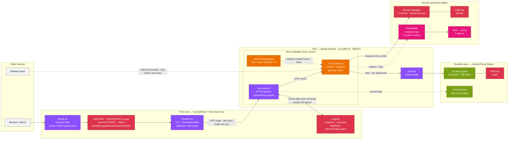

# Run an AI agent workspace 24/7 in your own AWS account

[Kiro Crew](https://kiro.dev/crew/) is a persistent agent workspace. It runs cron jobs, drives long
tasks, holds Slack and Discord connections, and accumulates memory across sessions. All of that only
works while the Gateway process is up, which makes a laptop an awkward host: close the lid and your
scheduled jobs stop and your integrations drop.

This post walks through deploying that Gateway into your own AWS account as a single CloudFormation
stack, so it runs continuously and heals itself when the host goes away. All durable state lives in
Amazon S3, so the EC2 instance is disposable: a replacement resumes your memories, conversations,
crons and skills, and comes back already signed in.

The template is 82 resources. `cfn-lint` and the AWS CLI are the only tools you need. Everything here
has been deployed and exercised against a live account.

**Repository: [github.com/aidin-repo/kirocrew-on-aws](https://github.com/aidin-repo/kirocrew-on-aws)**

## What you can do with it

**Scheduled agent work.** A nightly dependency-and-CVE sweep across your repositories. A morning
digest of issues and pull requests waiting on you. A recurring report that reads one system and
writes to another. Cron jobs need a host that is awake at 3am.

**Long tasks you start and walk away from.** A migration across dozens of files, a refactor with a
test loop, a backlog of small fixes. Kick it off from your phone, close the laptop, read the result
later.

**Chat-driven operations.** With Slack or Discord connected, a team talks to one Crew instance that
keeps its memory across conversations, instead of everyone running a separate short-lived agent.

**A shared team workspace.** Memory, lessons and skills accumulate in one place. Amazon Cognito
controls who reaches the dashboard, and an owner tag lets you run more than one Gateway in the same
account.

**Private deployment for sensitive work.** Everything sits in your account, in private subnets, with
conversation content in a bucket encrypted by a customer-managed KMS key.

## Solution overview



The Gateway runs as a Docker container under systemd on a Graviton instance in a private subnet. Its
data home is an S3-backed filesystem mounted over NFS, so memories, conversations, cron definitions,
skills and the signed-in CLI credential store all live in a versioned S3 bucket instead of on the
instance.

Boot is four systemd units in order:

1. `crew-mount.service` — mount the S3-backed data home.
2. `crew-secrets.service` — fetch secrets from AWS Secrets Manager using the instance role.
3. `crew-gateway.service` — start the container, listening on port 5476.
4. `crew-health.timer` — publish three CloudWatch metrics on a schedule.

Because nothing durable sits on the instance, an Auto Scaling group can replace it freely. The group
is fixed at one instance — the data home is SQLite, so a second writer is not safe — and exists only
to self-heal, never to scale.

### Two access modes

**`front-door`** builds a public HTTPS entry point on your own domain: Route 53 to AWS WAF to
CloudFront to an internal Application Load Balancer that performs Cognito authentication, then to the
Gateway. Three layers guard it — WAF and CloudFront, then Cognito, then Crew's own minted session
token. Cognito is additive; it never replaces Crew's token.

**`ssm-only`** builds none of that. No CloudFront, no ALB, no WAF, no Cognito, no certificate, no
domain requirement. The host security group has no inbound rule at all, and you reach the dashboard
by forwarding a port over AWS Systems Manager. This is the default and the cheapest useful shape.

`front-door` exists for phone and browser access from anywhere. It has a hard prerequisite: an ALB can
only do Cognito authentication on an HTTPS listener, that listener needs a certificate matching the
host CloudFront forwards, and ACM will not issue a certificate for a `cloudfront.net` name. So a
registered domain is required, with no workaround.

## Prerequisites

**The region is us-east-1, and it is not a parameter.** CloudFront's viewer certificate and a
`CLOUDFRONT`-scoped WAF web ACL can only exist there. The template asserts this and fails fast.

On your machine:

| Requirement | Notes |
|---|---|
| AWS CLI v2 | Recent enough to include `s3files`. The scripts fall back to boto3, so an older CLI works if botocore is current. |
| `cfn-lint` | `pip install cfn-lint`. The deploy script refuses to run without it. |
| Python 3 | Used by the scripts for JSON and CIDR arithmetic. |
| `gh`, authenticated | Only for image verification. Docker is not required. |
| Credentials that can create IAM roles | The stack creates two IAM roles, two KMS keys, Cognito, CloudFront and WAF. |

If you reuse an existing VPC, it needs two private subnets in distinct Availability Zones, both with
a default route to a NAT or transit gateway, and DNS hostnames and DNS resolution both enabled. The
deploy script verifies all of this before creating anything.

If you want `front-door`, you also need a registered domain, a Route 53 public hosted zone for it in
the same account, and one ACM certificate in us-east-1 with status `ISSUED` covering that domain.
Because the region is pinned, that single certificate serves both the CloudFront viewer connection
and the ALB listener.

## Walkthrough

### Step 1 — Verify the container image

Resolve the image to an immutable digest and check its SLSA build provenance before you run it:

```bash
git clone https://github.com/aidin-repo/kirocrew-on-aws.git && cd kirocrew-on-aws
scripts/verify-image.sh stable
```

The script talks to the registry API directly with an anonymous pull token, so no container runtime
is needed. It prints the multi-arch index digest on stdout — pin that value, not a per-architecture
digest, so one parameter works on Graviton and x86 alike.

### Step 2 — Fill in your parameters

```bash
cp infra/params.example.json infra/params.json
$EDITOR infra/params.json
```

The example file documents every parameter inline. The ones that matter most:

| Parameter | Default | Notes |
|---|---|---|
| `AccessMode` | `ssm-only` | `front-door` requires a domain and one ACM cert |
| `NetworkMode` | `existing` | `existing` reuses your VPC and NAT, usually at no extra cost |
| `VpcId`, `PrivateSubnetIds` | — | Two private subnets in distinct AZs |
| `DomainName`, `HostedZoneId`, `CertificateArn` | — | Required for `front-door` |
| `InstanceType` | `r8g.large` | Graviton4, 2 vCPU / 16 GiB. Subagent concurrency scales with memory, so `r8g.xlarge` is the lever for wider fan-out |
| `MfaMode` | `ON` | Only weaken deliberately: this is a public endpoint fronting a shell-capable agent |
| `ContainerImageDigest` | pinned | The value from step 1 |
| `NotificationEmail` | — | Alarm destination |
| `OwnerTag` | `kirocrew` | Distinguishes multiple Gateways in one account |

`infra/params.json` is gitignored. Do not commit it.

### Step 3 — Validate without creating anything

```bash
scripts/deploy.sh --params infra/params.json --validate-only
```

This runs the pre-flight checks that CloudFormation cannot: subnet egress routes, distinct
Availability Zones, VPC DNS settings, S3 Files availability in the account, certificate status, and
whether any other security group in the VPC admits your Crew subnets by CIDR. Each check that fails
names the offending resource.

One honest caveat: the template is 77 KB, past CloudFormation's 51,200-byte inline limit, so
validation has to happen from S3. The script creates a private encrypted staging bucket if one is
absent and uploads the template. No stack and no Crew infrastructure is created.

### Step 4 — Deploy

```bash
scripts/deploy.sh --params infra/params.json
```

Add `--stack <name>` to run more than one, `--profile <name>` to pick credentials.

### Step 5 — Two things only a human can do

The deployment is not usable until both are done.

**Confirm the SNS subscription.** AWS emails `NotificationEmail`. Until you click the link, no alarm
can reach you.

**Sign in `kiro-cli` on the host.** There is no fixed instance id under an Auto Scaling group, so
resolve it first:

```bash
ASG=$(aws cloudformation describe-stacks --stack-name kirocrew \
  --query 'Stacks[0].Outputs[?OutputKey==`AutoScalingGroupName`].OutputValue' --output text)

INSTANCE=$(aws autoscaling describe-auto-scaling-groups --auto-scaling-group-names "$ASG" \
  --query 'AutoScalingGroups[0].Instances[0].InstanceId' --output text)

aws ssm start-session --region us-east-1 --target "$INSTANCE"
```

Then, on the host:

```bash
sudo docker exec -it crew kiro-cli login --use-device-flow --license pro
```

Both flags matter. `--use-device-flow` prints a code to enter in your own browser, because a headless
host has no browser to launch. `--license pro` selects IAM Identity Center rather than a free Builder
ID. Agent sessions fail until this finishes, and the `GatewayHealthy` alarm fires in the meantime,
which is expected during bootstrap.

Verify:

```bash
sudo docker exec crew kirocrew doctor
```

Expect kiro-cli present and authenticated, config valid, embeddings available.

## Using it

### Open the dashboard

In `front-door` mode, browse to the stack's `DashboardUrl` output. Create your user in the Cognito
user pool first — self-signup is disabled by design.

In `ssm-only` mode, forward the port and use `localhost:5476`:

```bash
aws ssm start-session --region us-east-1 --target "$INSTANCE" \
  --document-name AWS-StartPortForwardingSession \
  --parameters '{"portNumber":["5476"],"localPortNumber":["5476"]}'
```

Either way, Crew mints its own session token on the host:

```bash
sudo docker exec crew kirocrew token --ttl 12h
```

Mint it immediately before use. The printed URL names `localhost`, so behind the front door you
substitute your own domain or paste the bare token into the dashboard's banner field.

### Pause it

Scale the group to zero. Do not stop the instance — an Auto Scaling group reads a stopped instance as
unhealthy and terminates it, so stopping destroys the host rather than pausing it.

```bash
aws autoscaling set-desired-capacity --auto-scaling-group-name "$ASG" --desired-capacity 0
aws autoscaling set-desired-capacity --auto-scaling-group-name "$ASG" --desired-capacity 1
```

### Watch it

A health timer publishes `GatewayHealthy`, `DataHomeReadable` and `BucketAccessible` to the
`KiroCrew/<stack-name>` namespace, with no dimensions so they stay alarmable across instance
replacement. Five CloudWatch alarms notify the SNS topic. Container logs go to CloudWatch Logs, ALB
access logs to the log bucket, and S3 Files publishes `PendingExports` and `ExportFailures` under
`AWS/S3/Files`.

### Prove the self-healing

`scripts/rebuild-drill.sh` terminates the instance through the Auto Scaling group, times the
recovery, and asserts data integrity afterwards. Measured on a live deployment:

| Action | Instance | Time to healthy |
|---|---|---|
| Reboot | same host kept | under 90s; the ASG does not react |
| Terminate | replaced automatically | **134s** |
| Stop | terminated and replaced | 237s |

Through all three the sentinel file's ETag stayed byte-identical and the kiro-cli credential store
came through unchanged, so the replacement host resumes already signed in. That is what makes the
compute genuinely disposable rather than merely rebuildable.

One storage detail worth knowing before you rely on a restore: the S3 export is asynchronous, with
export age measured at about 66 seconds under light load, and a SQLite database is three objects
(`.db`, `.db-wal`, `.db-shm`) exported independently. Stop the container before taking a restore, so
SQLite checkpoints and the WAL drains.

## Cost

Magnitudes rather than calculator output:

| Configuration | Rough monthly |
|---|---|
| `ssm-only` + existing VPC | An instance and a bucket. The cheapest useful shape |
| `ssm-only` + created VPC + NAT instance | Above, plus a few dollars |
| `front-door` + created VPC + NAT gateway | Above, plus roughly $32 NAT and $16–22 ALB |

The instance dominates in every case, around $86/month for `r8g.large`, so a Savings Plan is the main
lever on a 24/7 workload. Two KMS keys add about $2/month, and S3 Bucket Keys keep KMS request charges
negligible. Scaling to zero removes most of the bill; the ALB, CloudFront and NAT keep charging.

## Security posture

- Instance in a private subnet, no public IP, no key pair, IMDSv2 required with hop limit 1.
- In `ssm-only` mode, no inbound security-group rule at all.
- State bucket encrypted with a customer-managed key, versioned, Block Public Access fully on, and
  non-TLS requests denied.
- Crew's OS-level agent sandbox stays enabled. The upstream seccomp profile is pinned by SHA256 and
  boot fails closed on mismatch.
- Secrets live in Secrets Manager and are fetched by the instance role at boot. No secret value
  appears in the template, in parameters, in user data, or in any log.

Two limits worth stating plainly. The state key's policy is a single delegate-to-IAM statement, so any
principal in the account with S3 and KMS permissions can read conversation content — the key buys
rotation control, a distinct ARN and a kill switch, not isolation from your own admin role. And the
container has no `systemd-run`, so agent subprocesses get user-namespace isolation but no cgroup
memory or process-count ceiling; instance memory is the only backstop against a runaway.

Availability is bounded to one Availability Zone on purpose. There is a single S3 Files mount target,
and an instance launched elsewhere cannot reach it and fails closed at the mount unit. An AZ outage is
an outage.

## Cleanup

```bash
aws cloudformation delete-stack --region us-east-1 --stack-name kirocrew
```

Deleting the stack removes the Auto Scaling group, which terminates the instance. The state bucket and
the log bucket carry `DeletionPolicy: Retain`, so your data survives and shows as `DELETE_SKIPPED` —
delete those buckets by hand when you actually mean to. With an existing VPC, the stack never owned
your network, so neither the VPC nor the NAT is touched.

The same retention applies to a failed create: rollback keeps the bucket, and a later deploy under the
same stack name collides with it. Delete the leftover bucket or pick a different stack name.

## Conclusion

An always-on Gateway turns Crew from a session you babysit into a workspace that keeps working:
scheduled jobs fire on time, long tasks finish without you watching, and chat integrations stay
connected. Holding all durable state in S3 is what makes that affordable to operate, because the host
stops being precious — you can terminate it, and 134 seconds later everything is back, memory intact
and still signed in.

The repository has the full template, both access modes, the pre-flight checks, a rebuild drill you
can run yourself, and a runbook covering day-two operations.

**[github.com/aidin-repo/kirocrew-on-aws](https://github.com/aidin-repo/kirocrew-on-aws)**

### Further reading

- [Kiro Crew](https://github.com/kirodotdev/KiroCrew) — the project this deploys
- [Running Crew 24/7](https://kiro.dev/docs/crew/running-24-7/) — upstream guidance on remote hosts
- [Crew security model](https://kiro.dev/docs/crew/security/) — the layers this deployment relies on
